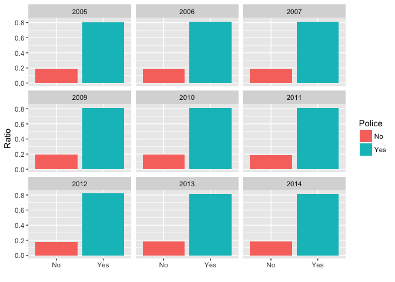
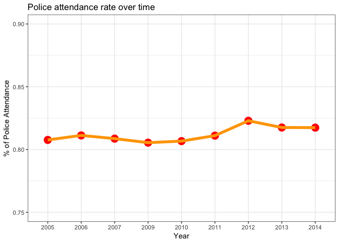
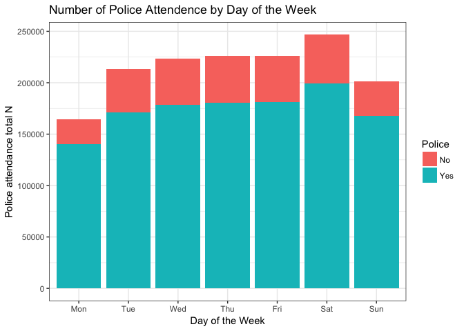
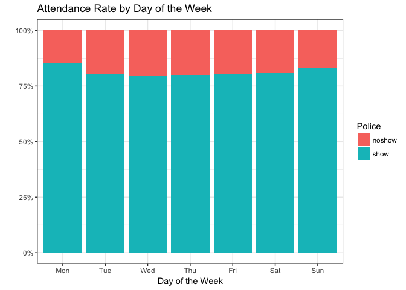
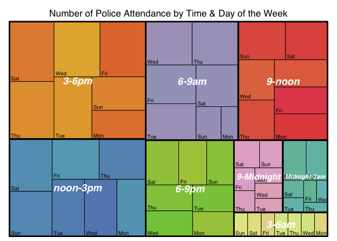
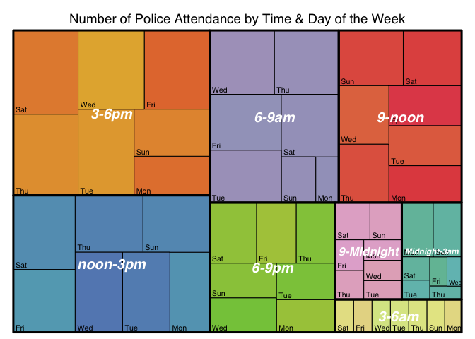

```r
library(tidyverse)
library(lubridate)
library(treemap)
library(scales) # % format in plot
#devtools::install_github("timelyportfolio/d3treeR")
library(d3treeR)
```
#### Read in data

```r
d1 <- read.csv("accidents_2005_to_2007.csv")%>%select(Accident_Severity,Number_of_Vehicles:Day_of_Week,Weather_Conditions:Year,Time)
d2 <- read.csv("accidents_2009_to_2011.csv")%>%select(Accident_Severity,Number_of_Vehicles:Day_of_Week,Weather_Conditions:Year,Time)
d3 <- read.csv("accidents_2012_to_2014.csv")%>%select(Accident_Severity,Number_of_Vehicles:Day_of_Week,Weather_Conditions:Year,Time)
data <- bind_rows(d1,d2,d3)
```

#### Clean up a bit

```r
#Label 
data$Day_of_Week=factor(data$Day_of_Week,levels=1:7,labels=c("Mon","Tue","Wed","Thu","Fri","Sat","Sun"))
# remove missing outcome info
data%>%rename(Police=Did_Police_Officer_Attend_Scene_of_Accident)%>%filter(Police!="")->data1
# fix format
data1$Year=as.character(data1$Year)
# hour categories
data1$hour=hour(hm(data1$Time))
data1$hour_cat <- cut(data1$hour,breaks = c(0, 3,6,9, 12,15, 18,21, 24), include.lowest = TRUE,labels=c("Midnight-3am","3-6am","6-9am","9-noon","noon-3pm","3-6pm","6-9pm","9-Midnight"))
```

### 1. Police Attendance Overall Trend by Year (% of attendance)


```r
# subset of data
data1%>%select(Year,Police) ->subdata

## get counts convert to percentage

subdata%>%filter(Police=="Yes")%>%group_by(Year)%>%summarise(show_yr=n())->shown_yr
subdata%>%filter(Police=="No")%>%group_by(Year)%>%summarise(noshow_yr=n())->noshown_yr

yrdata <- bind_cols(shown_yr,noshown_yr)%>%select(Year,show_yr,noshow_yr)
# calculate percentage:

yrdata%>%mutate(Yes_ratio=show_yr/(show_yr+noshow_yr))%>%mutate(No_ratio=1-Yes_ratio)->yrdata

yrdata%>%select(-show_yr,-noshow_yr)%>%gather("Police","Ratio",-Year)->yrdata2
yrdata2$Police=gsub("_ratio","",yrdata2$Police)

p2 <- ggplot(data=yrdata2,aes(x=Police,y=Ratio,fill=Police))+geom_bar(stat="identity",position="dodge")+facet_wrap(~Year) + xlab("")
```

#### Attempt 1: Bar graph
<!-- -->

#### The figures look almost identical on the 0-1 ratio scale (not informative--bad!). 

#### Attempt 2: Line graph to show trend overtime.


```r
##For line graphs, the data points must be grouped so that it knows which points to connect. In this case, it is simple – all points should be connected, so group=1. When more variables are used and multiple lines are drawn, the grouping for lines is usually done by variable.
ggplot(data=yrdata2%>%filter(Police=="Yes"),aes(x=as.factor(Year),y=Ratio,group=1))+geom_point(colour="red",size=5)+geom_line(colour="orange",size=2)+ylim(0.75,0.9)+xlab("Year")+ylab("% of Police Attendance")+theme_bw()+ggtitle("Police attendance rate over time") ->bar_grph
```

#### This looks better

<!-- -->

#### We can see that A. In recent years, the attendance rate increased slightly. B. Overall rate is between 0.8-0.82 --> Year is not very interesting.

### 2. Next, aggregating data from all years and answering the question: Does day of the week affect police attendance rate?


```r
data1%>%select(Police,Day_of_Week)->data1a

ggplot(aes(x = Day_of_Week), data = data1a) +
  geom_bar(stat = 'count', position = 'stack',aes(fill=Police)) +
  xlab('Day of the Week') +
  ylab('Police attendance total N') +
  ggtitle('Number of Police Attendence by Day of the Week ') +
  theme_bw()
```

<!-- -->

#### This plot tells us which day has the most accidents but hard to compare the % of attendance directly.

#### We need to convert the raw number to a ratio --> standarize them so we can compare

```r
## convert to percentage
data1a%>%filter(Police=="Yes")%>%group_by(Day_of_Week)%>%summarise(show=n())->shown
data1a%>%filter(Police=="No")%>%group_by(Day_of_Week)%>%summarise(noshow=n())->noshown

daydata <- bind_cols(shown,noshown)%>%select(Day_of_Week,show,noshow)%>%gather("Police","N",2:3)

#library--> scale
ggplot(daydata,aes(x = Day_of_Week, y = N,fill = Police)) + 
    geom_bar(position = "fill",stat = "identity") +
    scale_y_continuous(labels = percent_format())+xlab("Day of the Week")+ylab("")+ggtitle("Attendance Rate by Day of the Week")+theme_bw()
```

<!-- -->

#### We can see that police officers are working hard on Monday too!

### 3. Dive deeper and look at time of the day variable.

### Does time of the day matter? 

**Treemap**: Treemaps are ideal for displaying large amounts of **hierarchically structured** (tree-structured) data. The space in the visualization is split up into rectangles that are sized and ordered by a quantitative variable.


```r
data1%>%filter(Police=="Yes")%>%group_by(Day_of_Week,hour_cat)%>%summarise(showbyhour=n())->show_time

treemap(show_time, #Your data frame object
        index=c("hour_cat","Day_of_Week"), #A list of your categorical variables
        vSize="showbyhour", #This is your quantitative variable
        type="index", #Type sets the organization and color scheme of your treemap
        palette = "Set3", #Select your color palette from the RColorBrewer presets or make your own.
        fontsize.labels=c(15,8), 
        title='Number of Police Attendance by Time & Day of the Week',  
        fontcolor.labels=c("white","black"), 
        fontface.labels=c(4,1), 
        bg.labels=c("transparent"),  
        align.labels=list(c("center", "center"), c("left", "bottom")), 
        overlap.labels=1, 
        inflate.labels=F)
```

<!-- -->

### Q: Does this pattern match the pattern for the overall number of accident?


```r
data1%>%group_by(Day_of_Week,hour_cat)%>%summarise(accidentbyhour=n())->dataaccident

treemap(dataaccident, #Your data frame object
        index=c("hour_cat","Day_of_Week"), #A list of your categorical variables
        vSize="accidentbyhour", #This is your quantitative variable
        type="index", #Type sets the organization and color scheme of your treemap
        palette = "Set3", #Select your color palette from the RColorBrewer presets or make your own.
        fontsize.labels=c(15,8), 
        title='Number of Police Attendance by Time & Day of the Week',  
        fontcolor.labels=c("white","black"), 
        fontface.labels=c(4,1), 
        bg.labels=c("transparent"),  
        align.labels=list(c("center", "center"), c("left", "bottom")), 
        overlap.labels=1, 
        inflate.labels=F)->tree_accident
```

<!-- -->

### Make it interactive -- Zoom in

```r
# "rootname" becomes the title of the plot
inter=d3tree2( tree_accident ,  rootname = "Overall" )
inter
```

<!--html_preserve--><div id="htmlwidget-26f634429f470320b149" style="width:672px;height:480px;" class="d3tree2 html-widget"></div>
<script type="application/json" data-for="htmlwidget-26f634429f470320b149">{"x":{"data":{"name":"Overall","id":1,"size":null,"children":[{"name":"3-6am","color":"#FFFFB3","h":0.1088757466483,"id":2,"size":46135,"stdErr":46135,"vColor":7,"vSize":46135,"w":0.282284012382488,"x0":0.717715987617512,"y0":0,"children":[{"name":"Fri","color":"#E6D893","h":0.1088757466483,"id":3,"size":6707,"stdErr":6707,"vColor":1,"vSize":6707,"w":0.0410377993074531,"x0":0.759041363571372,"y0":0},{"name":"Mon","color":"#E6DC93","h":0.1088757466483,"id":4,"size":6183,"stdErr":6183,"vColor":1,"vSize":6183,"w":0.03783162563262,"x0":0.96216837436738,"y0":0},{"name":"Sat","color":"#E6E193","h":0.1088757466483,"id":5,"size":6754,"stdErr":6754,"vColor":1,"vSize":6754,"w":0.0413253759538599,"x0":0.717715987617512,"y0":0},{"name":"Sun","color":"#E6E693","h":0.1088757466483,"id":6,"size":6490,"stdErr":6490,"vColor":1,"vSize":6490,"w":0.0397100518123409,"x0":0.922458322555039,"y0":0},{"name":"Thu","color":"#E1E693","h":0.1088757466483,"id":7,"size":6646,"stdErr":6646,"vColor":1,"vSize":6646,"w":0.0406645615323294,"x0":0.88179376102271,"y0":0},{"name":"Tue","color":"#DCE693","h":0.1088757466483,"id":8,"size":6662,"stdErr":6662,"vColor":1,"vSize":6662,"w":0.0407624599651487,"x0":0.841031301057561,"y0":0},{"name":"Wed","color":"#D8E693","h":0.1088757466483,"id":9,"size":6693,"stdErr":6693,"vColor":1,"vSize":6693,"w":0.0409521381787361,"x0":0.800079162878825,"y0":0}]},{"name":"3-6pm","color":"#FDB462","h":0.546353607460376,"id":10,"size":359257,"stdErr":359257,"vColor":7,"vSize":359257,"w":0.43804459627263,"x0":0,"y0":0.453646392539624,"children":[{"name":"Fri","color":"#E4793C","h":0.261106264104668,"id":11,"size":57232,"stdErr":57232,"vColor":1,"vSize":57232,"w":0.14601871933062,"x0":0.29202587694201,"y0":0.738893735895332},{"name":"Mon","color":"#E4823C","h":0.129453099023224,"id":12,"size":32814,"stdErr":32814,"vColor":1,"vSize":32814,"w":0.168862659685554,"x0":0.269181936587075,"y0":0.453646392539624},{"name":"Sat","color":"#E48C3C","h":0.277678996097215,"id":13,"size":60227,"stdErr":60227,"vColor":1,"vSize":60227,"w":0.144489105857097,"x0":0,"y0":0.722321003902785},{"name":"Sun","color":"#E4953C","h":0.155794244332484,"id":14,"size":39491,"stdErr":39491,"vColor":1,"vSize":39491,"w":0.168862659685554,"x0":0.269181936587075,"y0":0.583099491562848},{"name":"Thu","color":"#E49E3C","h":0.268674611363161,"id":15,"size":58274,"stdErr":58274,"vColor":1,"vSize":58274,"w":0.144489105857097,"x0":0,"y0":0.453646392539624},{"name":"Tue","color":"#E4A73C","h":0.285247343355708,"id":16,"size":53392,"stdErr":53392,"vColor":1,"vSize":53392,"w":0.124692830729979,"x0":0.144489105857097,"y0":0.453646392539624},{"name":"Wed","color":"#E4B13C","h":0.261106264104668,"id":17,"size":57827,"stdErr":57827,"vColor":1,"vSize":57827,"w":0.147536771084913,"x0":0.144489105857097,"y0":0.738893735895332}]},{"name":"6-9am","color":"#BEBADA","h":0.570354379900374,"id":18,"size":246389,"stdErr":246389,"vColor":7,"vSize":246389,"w":0.2877818745757,"x0":0.43804459627263,"y0":0.429645620099626,"children":[{"name":"Fri","color":"#A2A3C4","h":0.185484939517941,"id":19,"size":44454,"stdErr":44454,"vColor":1,"vSize":44454,"w":0.159657415838937,"x0":0.43804459627263,"y0":0.602884230884829},{"name":"Mon","color":"#A2A2C4","h":0.151308307181479,"id":20,"size":11664,"stdErr":11664,"vColor":1,"vSize":11664,"w":0.0513536884198347,"x0":0.674472782428496,"y0":0.429645620099626},{"name":"Sat","color":"#A4A2C4","h":0.207415243121665,"id":21,"size":39892,"stdErr":39892,"vColor":1,"vSize":39892,"w":0.128124458736764,"x0":0.597702012111567,"y0":0.580953927281105},{"name":"Sun","color":"#A6A2C4","h":0.151308307181479,"id":22,"size":17437,"stdErr":17437,"vColor":1,"vSize":17437,"w":0.0767707703169288,"x0":0.597702012111567,"y0":0.429645620099626},{"name":"Thu","color":"#A8A2C4","h":0.21163082959723,"id":23,"size":45645,"stdErr":45645,"vColor":1,"vSize":45645,"w":0.143681608184022,"x0":0.582144862664308,"y0":0.78836917040277},{"name":"Tue","color":"#AAA2C4","h":0.173238610785203,"id":24,"size":41519,"stdErr":41519,"vColor":1,"vSize":41519,"w":0.159657415838937,"x0":0.43804459627263,"y0":0.429645620099626},{"name":"Wed","color":"#ACA2C4","h":0.21163082959723,"id":25,"size":45778,"stdErr":45778,"vColor":1,"vSize":45778,"w":0.144100266391678,"x0":0.43804459627263,"y0":0.78836917040277}]},{"name":"6-9pm","color":"#B3DE69","h":0.429645620099626,"id":26,"size":180373,"stdErr":180373,"vColor":7,"vSize":180373,"w":0.279671391344882,"x0":0.43804459627263,"y0":0,"children":[{"name":"Fri","color":"#AEC849","h":0.200953707562023,"id":27,"size":26763,"stdErr":26763,"vColor":1,"vSize":26763,"w":0.0887208459362178,"x0":0.542425767142625,"y0":0.228691912537602},{"name":"Mon","color":"#A7C849","h":0.108169776448052,"id":28,"size":21227,"stdErr":21227,"vColor":1,"vSize":21227,"w":0.130728293188926,"x0":0.586987694428586,"y0":0},{"name":"Sat","color":"#A0C849","h":0.200953707562023,"id":29,"size":31487,"stdErr":31487,"vColor":1,"vSize":31487,"w":0.104381170869996,"x0":0.43804459627263,"y0":0.228691912537602},{"name":"Sun","color":"#99C849","h":0.114782041255843,"id":30,"size":25663,"stdErr":25663,"vColor":1,"vSize":25663,"w":0.148943098155956,"x0":0.43804459627263,"y0":0.11390987128176},{"name":"Thu","color":"#92C849","h":0.200953707562023,"id":31,"size":26114,"stdErr":26114,"vColor":1,"vSize":26114,"w":0.0865693745386687,"x0":0.631146613078843,"y0":0.228691912537602},{"name":"Tue","color":"#8BC849","h":0.12052213608955,"id":32,"size":23651,"stdErr":23651,"vColor":1,"vSize":23651,"w":0.130728293188926,"x0":0.586987694428586,"y0":0.108169776448052},{"name":"Wed","color":"#84C849","h":0.11390987128176,"id":33,"size":25468,"stdErr":25468,"vColor":1,"vSize":25468,"w":0.148943098155956,"x0":0.43804459627263,"y0":0}]},{"name":"9-Midnight","color":"#FCCDE5","h":0.320769873451325,"id":34,"size":71657,"stdErr":71657,"vColor":7,"vSize":71657,"w":0.148816796828292,"x0":0.717715987617512,"y0":0.1088757466483,"children":[{"name":"Fri","color":"#E3B0D2","h":0.101440690882432,"id":35,"size":9751,"stdErr":9751,"vColor":1,"vSize":9751,"w":0.0640359506547962,"x0":0.717715987617512,"y0":0.204927628395556},{"name":"Mon","color":"#E3B0D0","h":0.0678738299663901,"id":36,"size":8638,"stdErr":8638,"vColor":1,"vSize":8638,"w":0.084780846173496,"x0":0.781751938272308,"y0":0.238494489311599},{"name":"Sat","color":"#E3B0CD","h":0.123277300821637,"id":37,"size":14395,"stdErr":14395,"vColor":1,"vSize":14395,"w":0.0777885104885168,"x0":0.717715987617512,"y0":0.306368319277989},{"name":"Sun","color":"#E3B0CA","h":0.123277300821637,"id":38,"size":13144,"stdErr":13144,"vColor":1,"vSize":13144,"w":0.0710282863397753,"x0":0.795504498106029,"y0":0.306368319277988},{"name":"Thu","color":"#E3B0C7","h":0.0960518817472563,"id":39,"size":9233,"stdErr":9233,"vColor":1,"vSize":9233,"w":0.0640359506547962,"x0":0.717715987617512,"y0":0.1088757466483},{"name":"Tue","color":"#E3B0C4","h":0.0623499468376134,"id":40,"size":7935,"stdErr":7935,"vColor":1,"vSize":7935,"w":0.084780846173496,"x0":0.781751938272308,"y0":0.1088757466483},{"name":"Wed","color":"#E3B0C2","h":0.0672687958256848,"id":41,"size":8561,"stdErr":8561,"vColor":1,"vSize":8561,"w":0.084780846173496,"x0":0.781751938272308,"y0":0.171225693485914}]},{"name":"9-noon","color":"#FB8072","h":0.570354379900374,"id":42,"size":234738,"stdErr":234738,"vColor":7,"vSize":234738,"w":0.27417352915167,"x0":0.72582647084833,"y0":0.429645620099626,"children":[{"name":"Fri","color":"#E24E57","h":0.132670810931301,"id":43,"size":32323,"stdErr":32323,"vColor":1,"vSize":32323,"w":0.16230174221793,"x0":0.83769825778207,"y0":0.684208739053909},{"name":"Mon","color":"#E24E4F","h":0.12238074741601,"id":44,"size":29816,"stdErr":29816,"vColor":1,"vSize":29816,"w":0.16230174221793,"x0":0.83769825778207,"y0":0.429645620099626},{"name":"Sat","color":"#E2554E","h":0.183120450014789,"id":45,"size":35819,"stdErr":35819,"vColor":1,"vSize":35819,"w":0.130305729913803,"x0":0.869694270086197,"y0":0.816879549985211},{"name":"Sun","color":"#E25D4E","h":0.183120450014789,"id":46,"size":39547,"stdErr":39547,"vColor":1,"vSize":39547,"w":0.143867799237867,"x0":0.72582647084833,"y0":0.816879549985211},{"name":"Thu","color":"#E2654E","h":0.19359612318366,"id":47,"size":32511,"stdErr":32511,"vColor":1,"vSize":32511,"w":0.111871786933739,"x0":0.72582647084833,"y0":0.429645620099626},{"name":"Tue","color":"#E26E4E","h":0.132182371538274,"id":48,"size":32204,"stdErr":32204,"vColor":1,"vSize":32204,"w":0.16230174221793,"x0":0.83769825778207,"y0":0.552026367515635},{"name":"Wed","color":"#E2764E","h":0.193637806701925,"id":49,"size":32518,"stdErr":32518,"vColor":1,"vSize":32518,"w":0.111871786933739,"x0":0.72582647084833,"y0":0.623241743283286}]},{"name":"Midnight-3am","color":"#8DD3C7","h":0.320769873451325,"id":50,"size":64266,"stdErr":64266,"vColor":7,"vSize":64266,"w":0.133467215554196,"x0":0.866532784445804,"y0":0.1088757466483,"children":[{"name":"Fri","color":"#72BEA4","h":0.0968601085935017,"id":51,"size":5621,"stdErr":5621,"vColor":1,"vSize":5621,"w":0.0386594380546562,"x0":0.928829769615801,"y0":0.153009435478834},{"name":"Mon","color":"#72BEA9","h":0.17977607602729,"id":52,"size":18933,"stdErr":18933,"vColor":1,"vSize":18933,"w":0.070157554336376,"x0":0.866532784445804,"y0":0.249869544072335},{"name":"Sat","color":"#72BEAD","h":0.0773140049583446,"id":53,"size":7230,"stdErr":7230,"vColor":1,"vSize":7230,"w":0.0622969851699969,"x0":0.866532784445804,"y0":0.172555539113991},{"name":"Sun","color":"#72BEB1","h":0.17977607602729,"id":54,"size":17085,"stdErr":17085,"vColor":1,"vSize":17085,"w":0.0633096612178199,"x0":0.93669033878218,"y0":0.249869544072335},{"name":"Thu","color":"#72BEB5","h":0.0441336888305334,"id":55,"size":4715,"stdErr":4715,"vColor":1,"vSize":4715,"w":0.0711702303841991,"x0":0.928829769615801,"y0":0.1088757466483},{"name":"Tue","color":"#72BEB9","h":0.0636797924656905,"id":56,"size":5955,"stdErr":5955,"vColor":1,"vSize":5955,"w":0.0622969851699969,"x0":0.866532784445804,"y0":0.1088757466483},{"name":"Wed","color":"#72BEBE","h":0.0968601085935017,"id":57,"size":4727,"stdErr":4727,"vColor":1,"vSize":4727,"w":0.0325107923295428,"x0":0.967489207670457,"y0":0.153009435478834}]},{"name":"noon-3pm","color":"#80B1D3","h":0.453646392539624,"id":58,"size":298297,"stdErr":298297,"vColor":7,"vSize":298297,"w":0.43804459627263,"x0":0,"y0":0,"children":[{"name":"Fri","color":"#64A8BE","h":0.208133581202873,"id":59,"size":43092,"stdErr":43092,"vColor":1,"vSize":43092,"w":0.137924493426733,"x0":0,"y0":0},{"name":"Mon","color":"#64A3BE","h":0.265206030778092,"id":60,"size":35401,"stdErr":35401,"vColor":1,"vSize":35401,"w":0.0889240097493919,"x0":0.349120586523238,"y0":0},{"name":"Sat","color":"#649EBE","h":0.245512811336751,"id":61,"size":50831,"stdErr":50831,"vColor":1,"vSize":50831,"w":0.137924493426733,"x0":0,"y0":0.208133581202873},{"name":"Sun","color":"#6499BE","h":0.188440361761532,"id":62,"size":42165,"stdErr":42165,"vColor":1,"vSize":42165,"w":0.149061359756137,"x0":0.288983236516493,"y0":0.265206030778092},{"name":"Thu","color":"#6494BE","h":0.188440361761532,"id":63,"size":42730,"stdErr":42730,"vColor":1,"vSize":42730,"w":0.15105874308976,"x0":0.137924493426733,"y0":0.265206030778092},{"name":"Tue","color":"#648FBE","h":0.265206030778092,"id":64,"size":41983,"stdErr":41983,"vColor":1,"vSize":41983,"w":0.105457379772004,"x0":0.243663206751234,"y0":0},{"name":"Wed","color":"#648ABE","h":0.265206030778092,"id":65,"size":42095,"stdErr":42095,"vColor":1,"vSize":42095,"w":0.105738713324501,"x0":0.137924493426733,"y0":0}]}]},"meta":{"type":"index","vSize":"accidentbyhour","vColor":null,"stdErr":"accidentbyhour","algorithm":"pivotSize","vpCoorX":[0.0281214848143982,0.971878515185602],"vpCoorY":[0.0196850393700787,0.910314960629921],"aspRatio":1.48351162585094,"range":null,"mapping":[null,null,null],"draw":true},"legend":null,"options":{"celltext":"name","id":"id","valueField":"size","clickAction":null}},"evals":[],"jsHooks":[]}</script><!--/html_preserve-->
